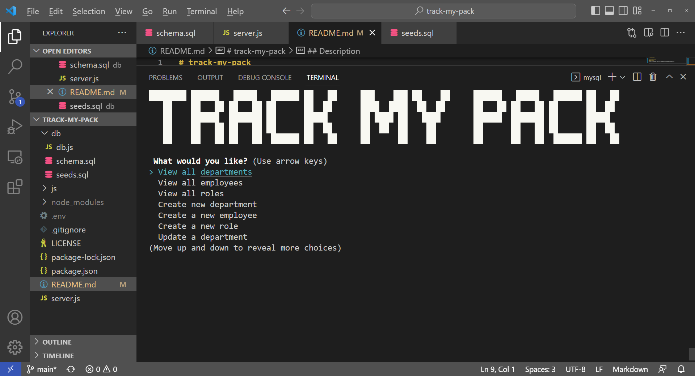

# Track My Pack  
You CLI companion to organize your company roster.

## Table of Contents
1. [Description](#description)  
2. [Usage](#usage)
3. [Contributors](#contributors)
4. [License](#license)  

## Description

This application allows the user to add, view, and modify their employee roster via the command line interface of their operating system. 

https://bravenbright.github.io/track-my-pack/
### Usage 

video demo: https://drive.google.com/file/d/1tR5kgXnB-tRKot8wIK8NM0UCql6MHKba/view

To use this application you will need  installed on your computer.

Once you have node installed and all code, you need to run 'npm i' to install all necessary packages that the application depends on located withing the package.json.

After you have successfully ran 'npm i' you should now be able to run 'node server.js' and then be prompted with the CLI questions via the terminal. 

#### Contributors
Brigita Biederman (aka bravenbright) 
 Github : https://github.com/bravenbright 
 Email : 

 #### License
Copyright (c) 2012-2022 Scott Chacon and others

Permission is hereby granted, free of charge, to any person obtaining
a copy of this software and associated documentation files (the
"Software"), to deal in the Software without restriction, including
without limitation the rights to use, copy, modify, merge, publish,
distribute, sublicense, and/or sell copies of the Software, and to
permit persons to whom the Software is furnished to do so, subject to
the following conditions:

The above copyright notice and this permission notice shall be
included in all copies or substantial portions of the Software.

THE SOFTWARE IS PROVIDED "AS IS", WITHOUT WARRANTY OF ANY KIND,
EXPRESS OR IMPLIED, INCLUDING BUT NOT LIMITED TO THE WARRANTIES OF
MERCHANTABILITY, FITNESS FOR A PARTICULAR PURPOSE AND
NONINFRINGEMENT. IN NO EVENT SHALL THE AUTHORS OR COPYRIGHT HOLDERS BE
LIABLE FOR ANY CLAIM, DAMAGES OR OTHER LIABILITY, WHETHER IN AN ACTION
OF CONTRACT, TORT OR OTHERWISE, ARISING FROM, OUT OF OR IN CONNECTION
WITH THE SOFTWARE OR THE USE OR OTHER DEALINGS IN THE SOFTWARE.
